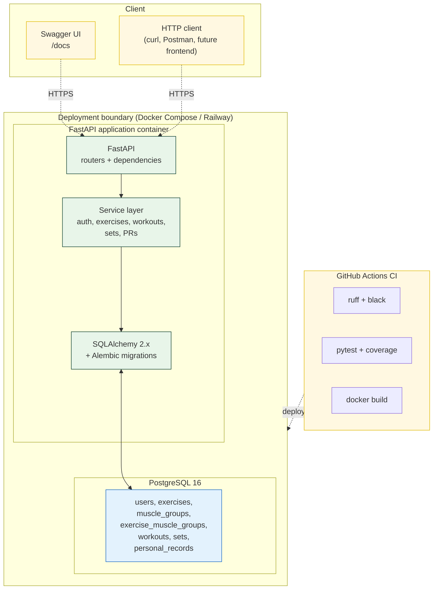

# Architecture

The Workout Tracker API is a single-container FastAPI service backed by PostgreSQL, deployed via Docker Compose locally and on a managed platform (Railway) in production.

## Layers

**Client.** Any HTTP client. In v1, the primary interface is Swagger UI (auto-generated by FastAPI at `/docs`) and tools like `curl` or Postman. A frontend application is explicitly out of scope per the brief (Section 5).

**API layer (FastAPI routers).** Thin route handlers. Parse and validate input via Pydantic, delegate to the service layer, format the response. No business logic.

**Service layer.** All business logic lives here: authentication, ownership checks, PR re-evaluation, exercise visibility rules (system vs custom), etc. Services are pure Python — they receive a database session and inputs, return domain objects. No HTTP concerns.

**ORM layer (SQLAlchemy).** Models, repository methods, and the unit-of-work pattern (one session per request, committed at the end of the request cycle). Alembic manages schema migrations as code.

**Database (PostgreSQL).** Single instance, single schema. All seven tables defined in `docs/ER.png`. Foreign keys enforce referential integrity; application code enforces invariants that span tables (e.g. exactly one primary muscle group per exercise).

**Deployment boundary.** Both the FastAPI container and the PostgreSQL container live inside the same Docker Compose network locally. In production (Railway), the database is a managed Postgres add-on but the network topology is equivalent: the app reaches it over a private connection.

**CI.** GitHub Actions runs on every push: linting (ruff), formatting check (black), test suite (pytest), and a Docker build. The deploy step is triggered on push to `main` after CI passes.

## Request lifecycle

A typical request — `POST /workouts/{id}/sets` — flows as follows:

1. Client sends HTTPS request with `Authorization: Bearer <jwt>`.
2. FastAPI router validates the JWT (dependency injection) and resolves the authenticated user.
3. An ownership dependency confirms the user owns the workout.
4. The request body is validated against a Pydantic schema.
5. The router calls `SetService.create(...)`.
6. The service inserts the new set, then calls `PersonalRecordService.recompute_for_exercise(...)` to update the PR state.
7. The unit of work commits the transaction.
8. The router serialises the response, including the computed `estimated_1rm` and `is_pr` flag.
9. FastAPI returns 201 with the response body.

This pattern repeats for every mutating endpoint: route → ownership check → validation → service → ORM → response.